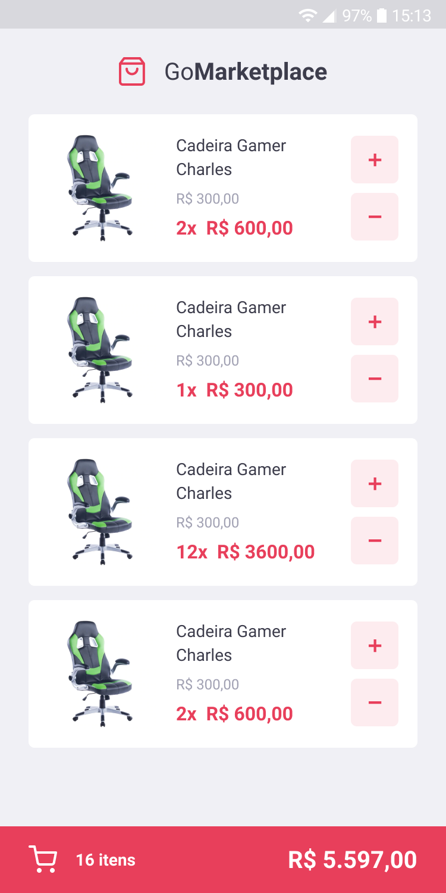

<div align="center">


</div>

### Screenshots
<div>
  
  
</div>

# :computer: Technologies
This project was made using the following technologies:
<ul>
  <li><a href="https://www.typescriptlang.org/">Typescript</a></li>
  <li><a href="https://reactnative.dev/">React Native</a></li>
</ul>

# :construction_worker: How to run
```bash
# Clone Repository
$ git clone https://github.com/vinicius-masiero/GoMarketplace.git
```

### 📦 Run fake API

This project uses a fake API using json-server to list the products. Remember to configure the API url inside the services folder based on the device you are running the app.
If you are running the app using Android Studio AVD: http://10.0.2.2:3333
If you are using the MacOS simulator: http://localhost:3333/

```bash
# Run API
$ yarn json-server server.json -p 3333
```

### 📱 Run Project

```bash
# Install dependencies
$ yarn install

# Run application
$ yarn android / yarn ios
```
